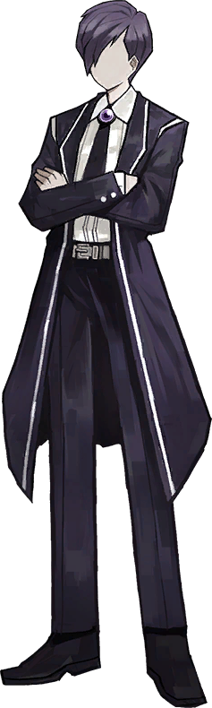
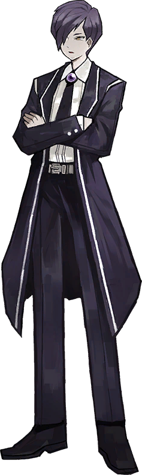
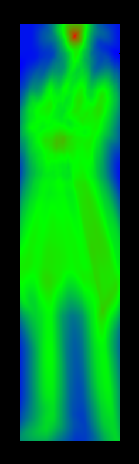
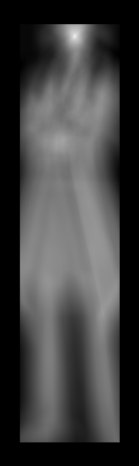

# ImageTemplateMatchingFramework
Image template matching framework designed for finding the closest match for an image in another image (Created in August 2021)

```cs
IMatchProcessor matchProcessor = new ParallelTemplateMatching()
{
    MaxDegreeOfParallelism = 12,
    ConsoleOutput = true,
    OptimizeLevel = ParallelTemplateMatching.OptimizationLevel.None,
    OptimizeSmoothing = true,
    Difference = ParallelTemplateMatching.DifferenceType.Manhattan
}; // Match processor we're using
//matchProcessor = new AForgeExhaustiveTemplateMatching() { MaxDegreeOfParallelism = 12 };
//matchProcessor = new CachedMatchProcessor(matchProcessor); //Convert match processor into a cached variant
IMatchResultProcessor resultProcessor = new ConsoleMultiResultProcessor( //define result processor
    new DefaultResultProcessor(), //Saves images as is
    //new DefaultFlippedResultProcessor(RotateFlipType.Rotate180FlipY), //Saves a flipped/rotated image
    new CalcResultProcessor(){Type = CalcResultProcessor.ResultType.Mask | CalcResultProcessor.ResultType.Heat}, //Process heatmaps if they exist
    new TemplateResultProcessor(){Type = TemplateResultProcessor.ResultType.Mask | TemplateResultProcessor.ResultType.Heat} //Process heatmaps if they exist
    );
using (var imgProcessor = 
    new ConsoleImageProcessor(
        Path.Combine(Directory.GetCurrentDirectory(), "Data"), //Directory to read from
        "Mods", //Sub directory where sub images are held
    matchProcessor, //supply match processor
    resultProcessor))//supply result processor
{
    try
    {
        imgProcessor.LoadInputs(); //Load files into inputs
        //imgProcessor.InputsToGrayscale();
        imgProcessor.Start(); //Start processing
    }
    catch (Exception e)
    {
        Console.WriteLine(e);
    }
}
```

Input Base Image           |  Input Sub Image          |  Result                   | Match Heatmap             | Match mask
:-------------------------:|:-------------------------:|:-------------------------:|:-------------------------:|:-------------------------:
  | |     | |
